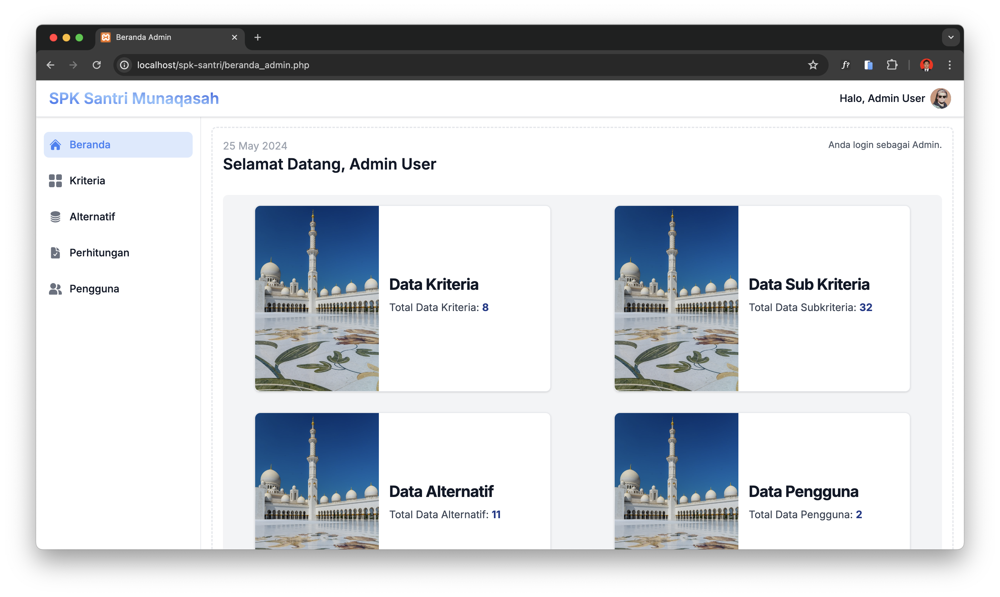
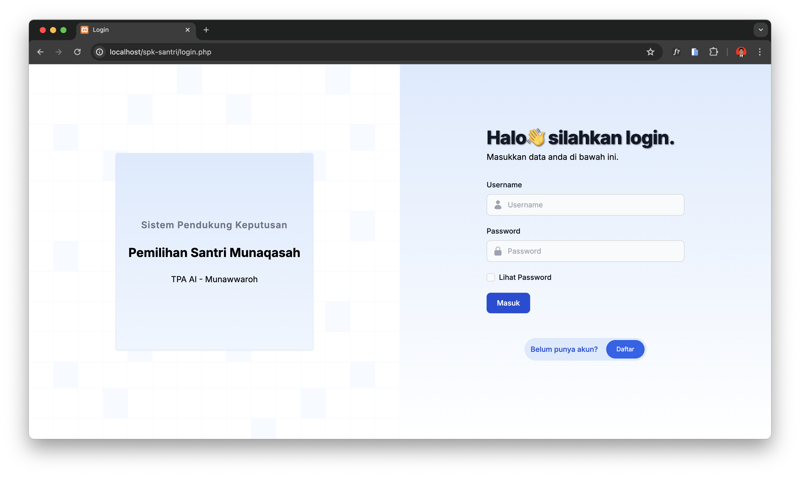
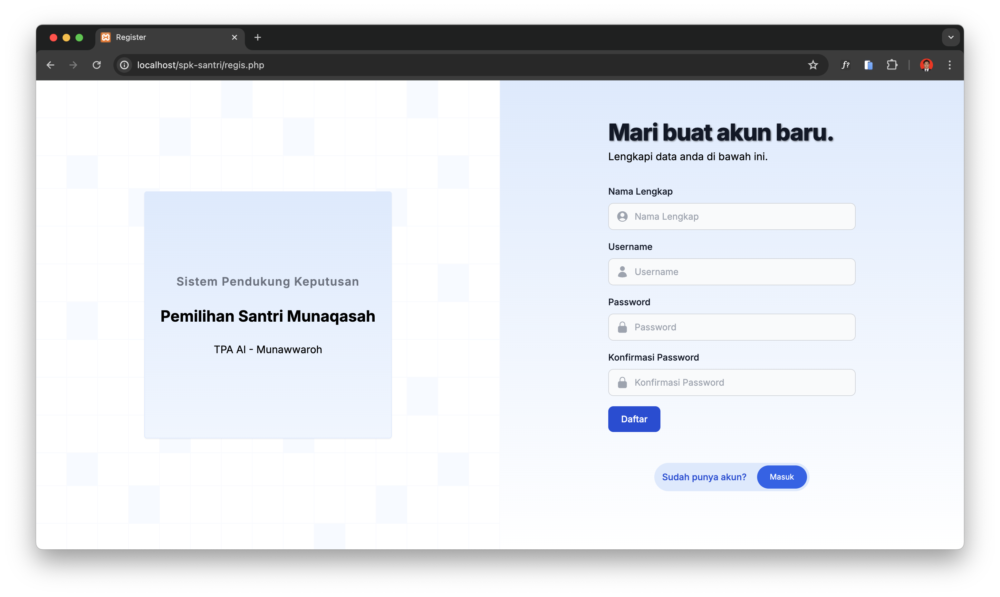
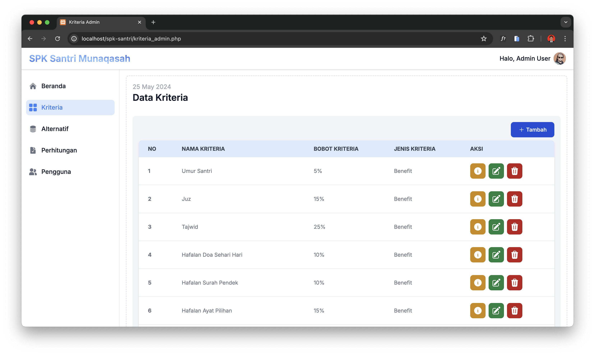

# DSS Santri Munaqasah

DSS Santri Munaqasah is a web-based system designed to support the process of selecting Munaqasah students by administrators and Quran teachers using the MOORA method. Representing an innovative and efficient solution, this platform provides sophisticated tools to facilitate decision-making in choosing students who meet specific criteria and needs.

## About This Project

This project was created during my free time as a simple portfolio project. I aimed to showcase my skills in web development and decision support systems. By building this project, I wanted to create something meaningful and practical, demonstrating my ability to apply various technologies in a cohesive and professional manner.

## Features

- **MOORA Method Implementation**: Utilizes the Multi-Objective Optimization on the basis of Ratio Analysis (MOORA) method for decision support.
- **User-Friendly Interface**: Simplified interface for administrators and Quran teachers.
- **Dynamic Criteria Management**: Easily manage criteria for student selection.
- **Real-time Analysis**: Provides immediate results based on input criteria.

## Built With

- **PHP (Native)**: Server-side scripting language.
- **JavaScript**: Client-side scripting.
- **jQuery**: JavaScript library for simplified scripting.
- **Tailwind CSS**: Utility-first CSS framework.

## Screenshots

*Home page of DSS Santri Munaqasah*

*Login page of DSS Santri Munaqasah*

*Register page of DSS Santri Munaqasah*

*Manage criteria for student selection*

## Getting Started

To get a local copy up and running, follow these simple steps.

### Prerequisites

- PHP >= 7.0
- MySQL
- Web Server (e.g., Apache)

### Contacts

- Email : muhammadnurazismu@gmail.com
- Linkedin : https://www.linkedin.com/in/muhammad-nur-azis-mujiono/
